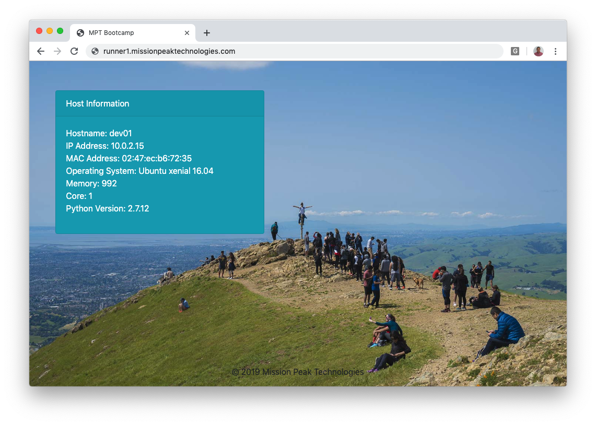

## LAB1 - Ansible Control Machine and Managed Nodes
---

### Goal
In this lab, you will learn the basic concepts of Ansible.

### Basic Concepts
A control machine is any computer or virtual machine where Ansible is installed to run commands and playbooks.

Managed nodes are machines or hosts that the control macnine connect to and to make configuration changes or to install software.

Inventory is a file (/etc/ansible/hosts) listing or grouping one or more managed nodes or hosts.

Configuration file (ansible.cfg) let you specify or change the default Ansible settings and behaviors. 

Playbooks are files that you define the configurations and tasks to play in the managed hosts.

Ansible works by connecting to the managed nodes from a control machine, and pushing out small programs, called "modules" defined in the playbook to them. Ansible then executes these modules over SSH by default, and removes them when finished. While passwords are supported, but SSH keys are the preferred and secured way to use Ansible.

### Exercises

* Login to an EC2 control machine using a Web terminal (Jupyter)
* Create a default inventory and configuration file
* Copy the Ansible admin user SSH key
* Verify Ansible is ready to use
* Run a playbook to install and configure a LAMP stack


#### Login to an EC2 control machine using a Web terminal (Jupyter)

1. Open the URL with Chrome or any browser. Where \<n\> is your student number.
```
http://console<n>.missionpeaktechnologies.com:8000/
```
2. Enter student\<n\>/student\<n\> for the usernamme and passowrd. For example, student1/student1
3. Next click the "Terminal" icon to open a web terminal session

4. Enter the following command to verified the installted Python and version
```console
cd ~/
pwd
whoam
echo $USER
which python
python --version
which ansible
ansible --version
````

#### Create a default inventory and configuration file

Depending on how Ansible is installed, the following default inventory and configuration may have created for you.

> /etc/ansible/ansible.cfg
> /etc/ansible/hosts


If the two files are not created, you can use the following steps to create them. Enter your student password if prompts when using escalated admin privilege.

1. Create the configuration file
```console
sudo mkdir -p ~/etc/ansible
sudo vi /etc/ansible/ansible.cfg
```
<pre>
[defaults]
 
host_key_checking=False
retry_files_enabled=False
 
#stdout_callback = yaml
#bin_ansible_callbacks = True`
</pre>

2. Create the inventory file

```console
sudo mkdir -p ~/etc/ansible
sudo vi /etc/ansible/hosts
```
<pre>
runner[1:20].missionpeaktechnologies.com        
</pre>

#### Copy the Ansible admin user SSH key

After creating a new machine or virtual machine, it is the best practice to harden the system security by disabling user/password login and enabling login using SSH key only. To use Ansible, we either need to generate a SSH key pair (private and public), or use an existing key pair with an administor user account. In this exercise, we will use the existing SSH key associated with the ubuntu user (for the Ubuntu OS). We will cover more detail in [LAB2 - SSH Basic](LAB2.md)

```console
mkdir -p ~/.ssh
sudo cp /home/ubuntu/.ssh/id_rsa ~/.ssh/id_rsa_ubuntu
sudo chown $USER: ~/.ssh/id_rsa/id_rsa_ubuntu
ls -ltr ~/.ssh
```

You should see something like below.

```console
student1@console1:~$ ls -la ~/.ssh
drwxrwxr-x 2 student1 student1 4096 Sep 16 03:01 .
drwxr-xr-x 5 student1 student1 4096 Sep 16 03:57 ..
-rw------- 1 student1 student1 1675 Sep 16 03:01 id_rsa_ubuntu
```

#### Verify Ansible is ready to use

To verify Ansible is installed, configured, and ready to use, enter the following commands in the Terminal window. The output should like something below.

```
student1@console1:~$ cd ~/
student1@console1:~$ which ansible
/usr/local/bin/ansible
```

```
student1@console:~$ ansible --version
ansible 2.5.1
  config file = /etc/ansible/ansible.cfg
  configured module search path = [u'/home/student1/.ansible/plugins/modules', u'/usr/share/ansible/plugins/modules']
  ansible python module location = /usr/local/lib/python2.7/dist-packages/ansible
  executable location = /usr/local/bin/ansible
  python version = 2.7.12 (default, Aug 22 2019, 16:36:40) [GCC 5.4.0 20160609]
```
```
student1@console1:~$ cat /etc/ansible/ansible.cfg
[default]

host_key_checking=False
retry_files_enabled=False

#stdout_callback = yaml
#bin_ansible_callbacks = True
```
```
student1@console1:~$ cat /etc/ansible/hosts
runner[1:20].missionpeaktechnologies.com  
```
```
student1@console1:~$ ansible all -u ubuntu --private-key=~/.ssh/id_rsa_ubuntu -m ping

runner1.lab.mpt.local | SUCCESS => {
    "changed": false,
    "ping": "pong"
}


```

#### Run a playbook to install and configure a LAMP stack

With Ansible is ready to use, let's see how we can use it to install the Apache, MySQL and PHP on a Linux machine (LAMP). Open a Terminal window and enter the following commands

```console
mkdir -p ~/bootcamp
cd ~/bootcamp
git clone https://github.com/mpt-bootcamp/ansible.git
cd ~/bootcamp/ansible/playbooks
ls -l *.yml
ansible-playbook --limit runner<n>.lab.mpt.local -u ubuntu --private-key=~/.ssh/id_rsa_ubuntu deploy-lamp.yml

```

To verify the LAMP stack is correctly installed and configured by Ansible, open the following URL with Chrome or any web browser.

```
http://runner\<n\>.missionpeaktechnologies.com/
```
Note, you need to replace \<n\> with your student number. For example,
```
http://runner1.missionpeaktechnologies.com/
```




---
### End of Lab1